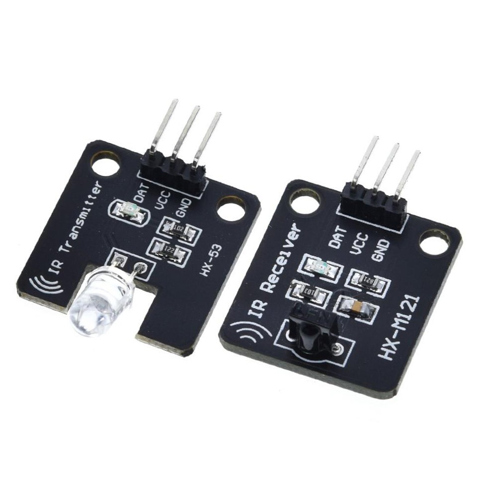

# ESP8266 IR Repeater
Transmits IR signals over Wi-Fi. Tested using NodeMCU V3 and some cheap IR modules.


## Requirements
- [IRremoteESP8266](https://github.com/crankyoldgit/IRremoteESP8266)
- The library in the libraries folder (copy to your libraries folder)

## Usage
### Sketch Setup
1. Install libraries
2. Change SSID and password at libraries/esp8266_ir_common

### ir-rx-component
1. Connect IR receiver DAT pin to NodeMCU pin D2
2. Connect VCC to NodeMCU pin VU
3. Connect GND to NodeMCU pin G

### ir-tx-component
1. Connect IR transmitter DAT pin to NodeMCU pin D2
2. Connect VCC to NodeMCU pin VU
3. Connect GND to NodeMCU pin G

## TO-DO
- One sketch for both client and server
- Clean the code up
- More features

## License
```
Copyright (c) 2022 3liteking148

Permission is hereby granted, free of charge, to any person obtaining a copy
of this software and associated documentation files (the "Software"), to deal
in the Software without restriction, including without limitation the rights
to use, copy, modify, merge, publish, distribute, sublicense, and/or sell
copies of the Software, and to permit persons to whom the Software is
furnished to do so, subject to the following conditions:

The above copyright notice and this permission notice shall be included in all
copies or substantial portions of the Software.

THE SOFTWARE IS PROVIDED "AS IS", WITHOUT WARRANTY OF ANY KIND, EXPRESS OR
IMPLIED, INCLUDING BUT NOT LIMITED TO THE WARRANTIES OF MERCHANTABILITY,
FITNESS FOR A PARTICULAR PURPOSE AND NONINFRINGEMENT. IN NO EVENT SHALL THE
AUTHORS OR COPYRIGHT HOLDERS BE LIABLE FOR ANY CLAIM, DAMAGES OR OTHER
LIABILITY, WHETHER IN AN ACTION OF CONTRACT, TORT OR OTHERWISE, ARISING FROM,
OUT OF OR IN CONNECTION WITH THE SOFTWARE OR THE USE OR OTHER DEALINGS IN THE
SOFTWARE.
```